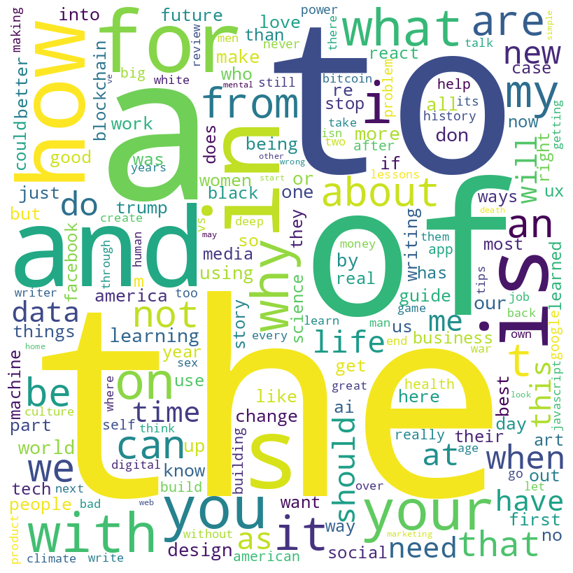

**Project Descriptions**

The Medium dataset is a collection of post titles from the Medium website. It contains a vast number of titles written by various authors, covering different topics such as technology, business, and politics. The dataset is publicly available on Kaggle, and interested parties can download it from https://www.kaggle.com/datasets/nulldata/medium-post-titles. In this project, we will be focusing on predicting the next words in a sentence using a language model. Specifically, we will be concentrating on predicting the possible sentences that a user may type based on the title's initial words. We will assume that the user will type the title in the search bar and build a model that can generate the most likely sentences to follow.